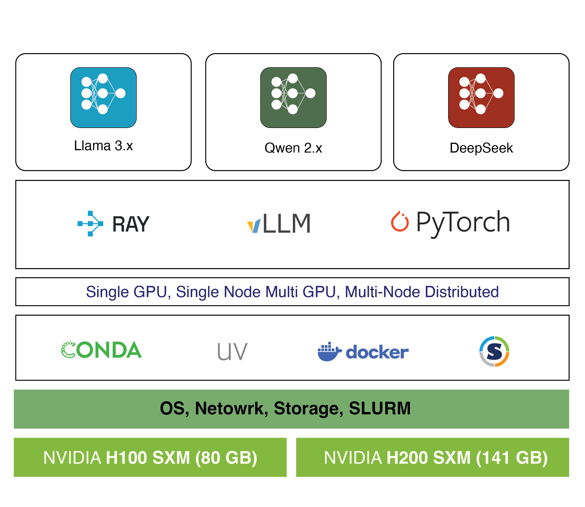

# Distributed Inference with vLLM

Executable documentation and knowledge base for running distributed LLM inference using vLLM on HPC clusters.

<p align="center">
  
</p>

## Overview

This repository provides reproducible recipes for deploying large language model inference at scale. Each workflow includes complete environment specifications, step-by-step instructions, and performance benchmarks tested on real GPU clusters.

**Key Features:**
- **Fully Reproducible** - Exact package versions, commit hashes, and hardware configs
- **Production-Ready** - Tested on HPC clusters with real workloads
- **Comprehensive Documentation** - From environment setup to troubleshooting
- **Multiple Parallelism Options** - Single GPU, tensor parallel, and multi-node setups

## Quick Start

```bash
# 1. Set up environment
cd envs/uv/u260304_vllm
export UV_CACHE_DIR=<your-cache-directory>  # Set cache directory
uv venv vllm_env --python 3.12 --seed       # Create virtual environment
source vllm_env/bin/activate                # Activate environment
uv pip install -r requirements-frozen.txt   # Install packages

# 2. Run a workflow
cd ../../..                                 # Return to repo root
cd workflows/Qwen2.5-32B-Instruct_single-gpu-inference
python simple_inference_test.py
```

See [workflows/](workflows/) for all available models and configurations.

## Repository Structure

```
├── envs/          # Reproducible runtime environments
├── workflows/     # Model inference recipes and examples
├── reports/       # Benchmarking and evaluation studies
├── workshops/     # Training and educational materials
├── scripts/       # Utility scripts and tools
└── CONTRIBUTING.md # Detailed contribution guidelines
```

## Getting Started

### 1. Choose Your Path

**For Quick Testing:**
Start with a single-GPU workflow:
- [Qwen2.5-32B-Instruct](workflows/Qwen2.5-32B-Instruct_single-gpu-inference/) - 32B parameter model on A100/H100

**For Production Deployment:**
Review environment specifications in [envs/](envs/) and select the appropriate workflow from [workflows/](workflows/)

### 2. Set Up Environment

Each workflow specifies its required environment. Navigate to the environment directory and follow setup instructions:

```bash
cd envs/uv/u260304_vllm
# Follow README.md for installation
```

### 3. Run Workflow

Navigate to your chosen workflow and follow its README:

```bash
cd workflows/Qwen2.5-32B-Instruct_single-gpu-inference
# Follow README.md for execution
```

## Available Resources

- See [envs](envs/) for complete environment catalog.   
- See [workflows](workflows/) for complete workflow catalog with specifications.   

## Contributing

See [CONTRIBUTING.md](CONTRIBUTING.md) for detailed guidelines.

## License

See [LICENSE](LICENSE) for details.

## NEWS
- **2026-04-24**: Added uv environment with vLLM built from source ([u260423_vllm_compiled](envs/uv/u260423_vllm_compiled/)). This environment compiles every kernel locally against the FASRC CUDA 12.9 toolchain, with no precompiled wheel or bundled kernels. Use this when patching vLLM kernels or debugging build issues.
- **2026-03-26**: Added [Large Language Model Distributed Inference](workshops/w260326) workshop materials. The workshop was held virtually university-wide on March 26 for Harvard University affiliates.
- **2026-03-06**: Added [Meta-Llama-3.1-405B-Instruct-FP8 multi-node](workflows/Meta-Llama-3.1-405B-Instruct-FP8_multinode-server/) workflow. New workflow for deploying the 405B parameter model with FP8 quantization (382GB storage) on 8×H100 or 4×H200 GPUs. Features ~50% memory reduction vs FP16/BF16, improved throughput, and comprehensive HPC deployment guide with Ray cluster initialization, batch processing examples, and production-ready SLURM scripts.
- **2026-03-04**: First uv environment ([u260304_vllm](envs/uv/u260304_vllm/)) and workflow ([Qwen2.5-32B-Instruct single-GPU inference](workflows/Qwen2.5-32B-Instruct_single-gpu-inference/)). Includes vLLM 0.11.2 with CUDA 12.9 support and comprehensive documentation following the new contribution guidelines.
- **2025-06-09**: Added DeepSeek-R1-0528 workflow - an upgraded version with enhanced math, programming, and logic reasoning. See [DeepSeek-R1-0528 workflow](workflows/DeepSeek-R1-0528_multinode-server/) for details.
- **2025-06-09**: DeepSeek-R1 multi-node deployment. New conda environment ([c250609_vllm085](envs/conda/c250609_vllm085/)) with vLLM 0.8.5.post1 and comprehensive [workflow](workflows/DeepSeek-R1_multinode-server/) for deploying 671B parameter model with FP8 precision on 16×H100 or 8×H200 GPUs. Includes throughput benchmarks and SLURM scripts.
- **2024-10-09**: Added Llama 3.1 workflows from Timothy Ngotiaoco and Max Shad. Two new workflows: [Llama 3.1 70B](workflows/Llama-3.1-70B_multinode-server/) (4×H100) and [Llama 3.1 405B](workflows/Llama-3.1-405B_multinode-server/) (16×H100) with 128k context length support.
