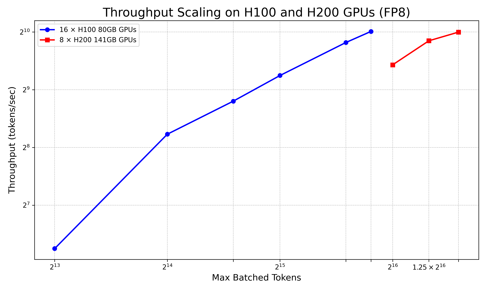

# DeepSeek-R1 671B Reasoning Model

DeepSeek-R1 671B ([Hugging Face Page](https://huggingface.co/deepseek-ai/DeepSeek-R1)) is a state-of-the-art large language model trained from scratch by DeepSeek-AI with a strong focus on advanced reasoning capabilities. This repository documents the deployment of DeepSeek-R1 671B using [vLLM](https://docs.vllm.ai/en/latest/index.html), leveraging **FP8** weights and optimized attention via FlashMLA to enable high-throughput inference on multi-GPU setups. Read about model architecture [here](https://pub.towardsai.net/deepseek-r1-model-architecture-853fefac7050).

Since an [NVIDIA H100 SXM GPU](https://www.nvidia.com/en-us/data-center/h100/) and an [NVIDIA H200 SXM GPU](https://www.nvidia.com/en-us/data-center/h200/) hold 80 GB and 141 GB of VRAM, respectively, this model is large enough to require a multi-GPU, multi-node setup.

We performed several experiments for the GPU VRAM memory requirements for this model to store the model weights and additional memory to hold the KV cache for requests using different token count. Sample deployment specs are listed below. 

## Sample Deployment Specs

- **Model**: DeepSeek-R1 671B
- **Precision**: FP8
- **Max Batched Tokens**: 57,344 tokens
- **Max Number of Sequences**: 112
- **VRAM Used**: 1,037 GB (81% of 1.28 TB)
- **Maximum GPU Utilization Limit**: 90%
- **GPUs**: 16 × NVIDIA H100 80GB (4-GPU Servers)

The estimated memory breakdown with above specs are

| Component       | Usage      |
|----------------|------------|
| Model Weights  | 671 GB    |
| KV Cache       | 366 GB    |
| **Total GPU VRAM** | 1,037 GB  |

This configuration supports total batched tokens up to 57,344 long and fits within the 90% VRAM limit on 16 × H100 GPUs.

We also experimented with different values for maximum batched tokens and the maximum number of sequences. The scaled tokens-per-second throughput is listed in the table below for H100 and H200 GPUs.

### Throughput Scaling: 16 × H100 80GB (FP8)

| Max # of Sequences | Max Batched Tokens | Throughput (tokens/s) |
| ---------------- | -------------------------- | --------------------- |
| 8                | 8192                       | 76                  |
| 32               | 16384                      | 300                  |
| 48               | 24576                      | 446                   |
| 64               | 32768                      | 607                   |
| 96               | 49152                      | 902                   |
| 112              | 57344                      | 1030                  |

### Throughput Scaling: 8 × H200 141GB (FP8)

| Max # of Sequences  |  Max Batched Tokens | Throughput (tokens/s) |
| ----------------- | -------------------------- | --------------------  |
| 96                | 65536                      | 690                   |
| 128               | 81920                      | 921                   |
| 144               | 98304                      | 1022                  |

By tuning the maximum number of sequences (`--max-num-seqs`) and the maximum number of batched tokens (`--max-num-batched-tokens`), we achieved up to 1030 tokens/sec throughput on both 16 × H100 or 8 × H200 GPU setups using the model's original FP8 weights. We specify both `--max-num-seqs` and `--max-num-batched-tokens` to explicitly control the maximum number of concurrent sequences and the total token budget per batch, ensuring efficient use of GPU memory and predictable throughput behavior during inference.

<div style="text-align: center;">
  <br>
  <em>Figure 1: Throughput scaling with H100 and H200 GPUs.</em>
</div>

Although both H100 and H200 configurations achieved similar peak throughput (~1030 tokens/sec), the H200 setup required nearly double the batch size to do so, highlighting its larger memory footprint and potential for scaling to higher context lengths or concurrent requests.

By following the instructions below, one should be able to set up a server running on a SLURM job for use with other experiments.

## Setup Instructions

1. Create and activate a conda environment.
    
    ```sh
    mamba create -n vllm-inference python=3.12
    mamba activate vllm-inference
    ```

1. Install Python dependencies.
    
    ```sh
    pip install -r requirements.txt
    ```

    > Since we want to use the FlashInfer library ([GitHub](https://github.com/flashinfer-ai/flashinfer)), we need to install a specific version of vLLM that is compatible with Torch 2.6.0 (CUDA 12.4).

1. Set parameters in the SLURM scripts (H100 or H200 GPUs).
  
    Find the SLURM scripts in the `server/` directory,

    16 H100 GPUs:
    ```sh
    #SBATCH --job-name=<job_name>
    #SBATCH --partition=<partition-name>
    #SBATCH --account=<account-name>
    #SBATCH --nodes=4                
    #SBATCH --ntasks-per-node=1
    #SBATCH --gpus-per-node=4
    #SBATCH --cpus-per-task=96
    #SBATCH --mem=1440G
    #SBATCH --exclusive
    #SBATCH --constraint=h100
    #SBATCH --time=03-00:00:00
    #SBATCH -o job.%N.%j.out
    #SBATCH -e job.%N.%j.err
    ```

   8 H200 GPUs (required changes):
    ```sh
    #SBATCH --partition=<partition-name>
    #SBATCH --nodes=2                
    #SBATCH --constraint=h200
    ```

1. Set vLLM parameters.

```sh
vllm serve $MODEL_PATH \
  --tensor-parallel-size $((SLURM_NNODES * SLURM_GPUS_ON_NODE)) \
  --max-num-seqs 112 \
  --max-num-batched-tokens 57344 \
  --gpu-memory-utilization 0.9 \
  --trust-remote-code \
  --enable-reasoning \
  --enforce-eager \
  --reasoning-parser deepseek_r1 \
  --distributed-executor-backend ray \
  --port 8000
```

The following table summarizes the key parameters used in the vLLM command above.

| Parameter | Description |
|-----------|-------------|
| `--tensor-parallel-size`       | Specifies the number of tensor parallel replicas.               |
| `--max-num-seqs`               | Maximum number of sequences.         |
| `--max-num-batched-tokens`     | Maximum number of tokens processed per iteration.                                   |
| `--gpu-memory-utilization`     | Fraction of GPU memory to be used by vLLM.                                           |
| `--trust-remote-code`          | Allows execution of custom code from remote repositories.                                 |
| `--enable-reasoning`           | Enables reasoning capabilities in vLLM.             |
| `--reasoning-parser`           | Specifies the reasoning parser to use.                                                                          |
| `--distributed-executor-backend` | Sets the backend for distributed execution.                                                  |
| `--port`                       | Pport on which vLLM server will listen for incoming requests.                               |


5. Run the SLURM script for the DeepSeek-R1 model.

    If you want to run the DeepSeek-R1 671B model on 16 x H100 80GB GPUs or 8 x H200 141GB GPUs, you should run the following command,

    ```bash
    sbatch server/deepseek_r1_h100_slurm.sh    # 16 x H100
    sbatch server/deepseek_r1_h200_slurm.sh    # 8 x H200
    ```

   Loading the model onto GPUs can take some time—up to 30–40 minutes on Lustre storage and around 20 minutes on VAST scratch storage. Repeated runs on VAST scratch storage can lead to a ~50–60 second speedup, thanks to VAST caching.

    You can check the progress of the model loading by looking at the error logs for the SLURM job, which should have lines like

    ```
    Loading safetensors checkpoint shards:   1% Completed | 1/163 [00:06<18:37,  6.90s/it]
    Loading safetensors checkpoint shards:   1% Completed | 2/163 [00:12<16:51,  6.28s/it]
    Loading safetensors checkpoint shards:   2% Completed | 3/163 [00:18<16:13,  6.09s/it]
    ```

    When the model is fully loaded and the server is ready to handle requests, you should see lines like

    ```
    INFO:     Starting vLLM API server on http://0.0.0.0:8000
    ```

## Using the vLLM Server

The vLLM server will be set up on the first node (head node) of the SLURM job. In the SLURM job logs, it is listed as,

```
Head node: holygpu8a11301
```

The server will then be running on `localhost:8000` on the head node. You can send HTTP requests to the `/v1/completions` endpoint to run the model on your prompts. The `system` role is used to define the assistant's behavior and tone before any user interaction begins. This message helps "prime" the model with context or instructions.

### Single Prompt

Use the following `curl` or Python code snippet to send a single prompt. 

```sh
curl -sS http://holygpu8a13402.rc:8000/v1/chat/completions \
  -H "Content-Type: application/json" \
  -d '{
    "model": "/n/holylfs06/LABS/kempner_shared/Everyone/testbed/models/DeepSeek-R1",
    "messages": [
      {
        "role": "system",
        "content": "You are a helpful and knowledgeable assistant. Answer concisely and clearly using academic language."
      },
      {
        "role": "user",
        "content": "Explain gravitational wave in detail."
      }
    ]
}' | jq -r '.choices[0].message.content'
```
Note that the `model` field for the JSON needs to be the directory of the model being served.

- DeepSeek-R1 671B: `/n/holylfs06/LABS/kempner_shared/Everyone/testbed/models/DeepSeek-R1`

For Python applications, you can use the `requests` library to send your HTTP requests.

```python
import requests

res = requests.post(
    "http://holygpu8a13402.rc:8000/v1/chat/completions",
    json={
        "model": "/n/holylfs06/LABS/kempner_shared/Everyone/testbed/models/DeepSeek-R1": [
            {"role": "system", "content": "You are a helpful and knowledgeable assistant. Answer concisely and clearly using academic language."},
            {"role": "user", "content": "Explain gravitational wave in detail."}
        ]
    }
)

data = res.json()
print(data['choices'][0]['message']['content'])
```

### Batches of Prompts

Use the following command to send batches of prompts for maximum throughput testing. Modify it to include your own prompts.

```sh
for i in {1..112}; do
  curl -sS http://holygpu8a13402.rc:8000/v1/chat/completions \
    -H "Content-Type: application/json" \
    -d '{
      "model": "/n/holylfs06/LABS/kempner_shared/Everyone/testbed/models/DeepSeek-R1",
      "messages": [
        {"role": "system", "content": "You are a helpful and knowledgeable assistant."},
        {"role": "user", "content": "Explain gravitational wave in detail."}
      ]
    }' &
done
wait
```

To send batches of unique prompts in Python, use following files in `/scripts` folder.

- `input_prompts.json`: Lists all prompts with unique tags. Consider adding a system prompt.
- `batch_prompt_sender.py`: Python script that loops through the prompts and sends them in batches.
- `output_responses.json`: Contains responses to the prompts, matched with their unique tags, for postprocessing.

The script uses the following configuration variables to control batching behavior and connection to the vLLM server:

- **`MAX_SEQS_PER_BATCH`**  
  The maximum number of concurrent prompts in a single batch and should match the `--max-num-seqs` parameter in the vLLM server.

- **`REQUEST_TIMEOUT`**  
  The maximum time (in seconds) to wait for a response from the server for each request.

- **`API_URL`**  
  The full URL of the vLLM server's chat completions endpoint.

- **`MODEL_PATH`**  
  The absolute filesystem path to the model checkpoint being served by the vLLM.

These values can be adjusted based on system capacity, deployment setup, and model configuration.

Run your code 

```sh
python batch_prompt_sender.py

```

Additional arguments are also available for adjusting how tokens are sampled. See the [vLLM docs](https://docs.vllm.ai/en/v0.4.1/models/engine_args.html) for the available arguments.