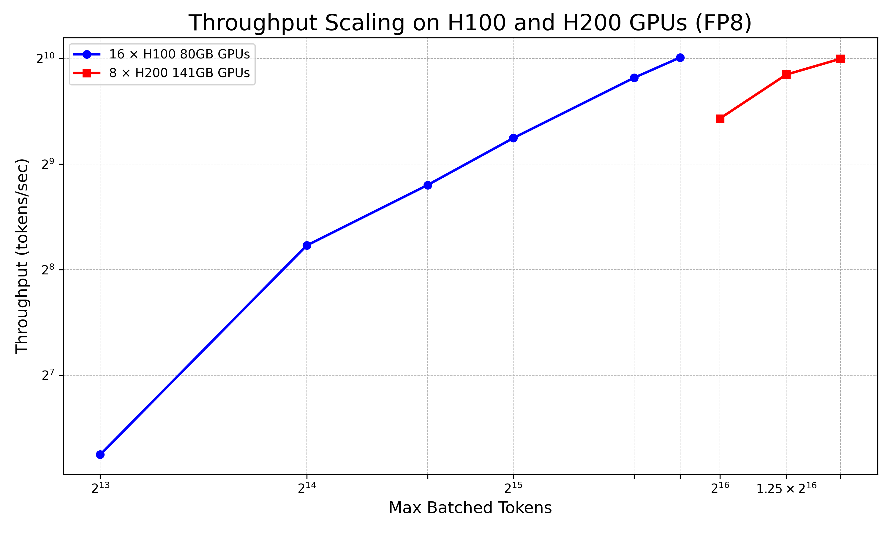
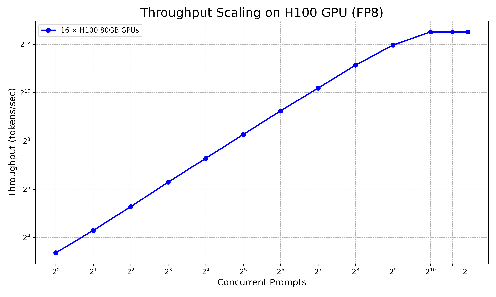

# DeepSeek-R1 - Multi-Node Server

## Overview

This workflow demonstrates deploying DeepSeek-R1, a 671B parameter large language model with advanced reasoning capabilities, using vLLM on multi-GPU, multi-node HPC clusters. The deployment uses FP8 precision with FlashMLA attention optimization for high-throughput inference across 16×H100 or 8×H200 GPUs.

## Workflow Contents

This workflow directory contains:

| File | Purpose |
|------|---------|
| **README.md** | This comprehensive deployment guide |
| **deepseek_r1_h100_slurm.sh** | SLURM script for 16×H100 80GB deployment |
| **deepseek_r1_h200_slurm.sh** | SLURM script for 8×H200 141GB deployment |
| **generate_fig_1.py** | Script to reproduce Figure 1 (H100 vs H200 throughput) |
| **generate_fig_2.py** | Script to reproduce Figure 2 (default batching throughput) |
| **figures/png/** | Performance visualization figures |

## Environment

**Environment used:**
```
envs/conda/c250609_vllm085
```

**Repository commit:**
```
cf2de1a3815c10c59e33349cd81aef64e68ea0ae
```

## Model Information

**Model:** DeepSeek-R1

**HuggingFace Link:** https://huggingface.co/deepseek-ai/DeepSeek-R1

**Model Size:** 671B parameters

**License:** MIT (check model card for latest)

**Precision:** FP8

**Context Length:** 163,840 tokens (max_position_embeddings)

**Architecture:** Advanced reasoning model with FlashMLA attention

Read about model architecture: https://pub.towardsai.net/deepseek-r1-model-architecture-853fefac7050

## Hardware Configuration

### Configuration 1: 16 × NVIDIA H100 80GB

- **GPU Type:** NVIDIA H100 80GB SXM
- **Number of GPUs:** 16
- **Number of Nodes:** 4
- **GPUs per Node:** 4
- **Network:** InfiniBand (recommended for multi-node)
- **Total GPU Memory:** 1,280 GB (80GB × 16)
- **VRAM Used:** ~1,037 GB (81% utilization)

**Memory Breakdown:**
| Component          | Usage         |
|--------------------|---------------|
| Model Weights      | 671 GB        |
| KV Cache           | 366 GB        |
| **Total GPU VRAM** | 1,037 GB      |

### Configuration 2: 8 × NVIDIA H200 141GB

- **GPU Type:** NVIDIA H200 141GB SXM
- **Number of GPUs:** 8
- **Number of Nodes:** 2
- **GPUs per Node:** 4
- **Total GPU Memory:** 1,128 GB (141GB × 8)

## Prerequisites

### 1. Environment Setup

Create and activate the conda environment (see [Environment](#environment) section above):

```bash
# Navigate to environment directory
cd envs/conda/c250609_vllm085

# Create environment
mamba env create -f environment.yml

# Activate environment
conda activate vllm-inference
```

See the environment's [README](../../envs/conda/c250609_vllm085/README.md) for detailed setup instructions.

### 2. Model Access

**Model Location:** The model checkpoint should be accessible on your filesystem.

Example path:
```
/path/to/models/DeepSeek-R1
```

**Size:** ~671 GB for FP8 weights

**Download:** Model can be downloaded from Hugging Face or use pre-downloaded checkpoint on shared storage.

### 3. SLURM Cluster Access

This workflow requires:
- SLURM job scheduler
- Multi-node GPU allocation
- H100 or H200 GPU nodes
- InfiniBand network (recommended for multi-node communication)

## Parallelism Configuration

### 16 × H100 Setup
- **Tensor Parallel Size:** 16 (across 4 nodes × 4 GPUs)
- **Pipeline Parallel Size:** N/A
- **Total Parallel Size:** 16

### 8 × H200 Setup
- **Tensor Parallel Size:** 8 (across 2 nodes × 4 GPUs)
- **Pipeline Parallel Size:** N/A
- **Total Parallel Size:** 8

## Step-by-Step Instructions

### 1. Prepare SLURM Script

Choose the appropriate script based on your hardware:

**For 16 × H100 80GB:**
```bash
workflows/DeepSeek-R1_multinode-server/deepseek_r1_h100_slurm.sh
```

**For 8 × H200 141GB:**
```bash
workflows/DeepSeek-R1_multinode-server/deepseek_r1_h200_slurm.sh
```

### 2. Configure SLURM Parameters

Edit the SLURM script header with your cluster-specific values:

```bash
#SBATCH --job-name=<your-job-name>
#SBATCH --partition=<your-partition>
#SBATCH --account=<your-account>
```

**For H100 (16 GPUs):**
```bash
#SBATCH --nodes=4
#SBATCH --gpus-per-node=4
#SBATCH --constraint=h100
```

**For H200 (8 GPUs):**
```bash
#SBATCH --nodes=2
#SBATCH --gpus-per-node=4
#SBATCH --constraint=h200
```

### 3. Set Model Path

Update the model path in the SLURM script:

```bash
MODEL_PATH="/path/to/your/DeepSeek-R1"
```

### 4. Submit Job

```bash
sbatch workflows/DeepSeek-R1_multinode-server/deepseek_r1_h100_slurm.sh
```

**Loading time:**
- Lustre storage: 30-40 minutes
- VAST scratch storage: ~20 minutes (first run), ~20 seconds (cached runs)

### 5. Monitor Job

```bash
# Check job status
squeue -u $USER

# Watch job output
tail -f job.*.out

# When ready, you should see:
# INFO:     Starting vLLM API server on http://0.0.0.0:8000
```

### 6. Connect to vLLM Server

The server runs on the head node (first node in allocation):

```bash
# From job logs, note the head node
# Example: "Head node: holygpu8a11301"

# Server is accessible at:
# http://<head-node>:8000
```

### 7. Send Inference Requests

**Single prompt (curl):**

```bash
curl -sS http://<head-node>:8000/v1/chat/completions \
  -H "Content-Type: application/json" \
  -d '{
    "model": "/path/to/DeepSeek-R1",
    "messages": [
      {
        "role": "system",
        "content": "You are a helpful and knowledgeable assistant. Answer concisely and clearly using academic language."
      },
      {
        "role": "user",
        "content": "Explain gravitational waves in detail."
      }
    ]
  }' | jq -r '.choices[0].message | {reasoning: .reasoning_content, final: .content}'
```

**Single prompt (Python):**

```python
import requests

res = requests.post(
    "http://<head-node>:8000/v1/chat/completions",
    json={
        "model": "/path/to/DeepSeek-R1",
        "messages": [
            {
                "role": "system",
                "content": "You are a helpful and knowledgeable assistant."
            },
            {
                "role": "user",
                "content": "Explain gravitational waves in detail."
            }
        ]
    }
)

data = res.json()
msg = data['choices'][0]['message']

print("Reasoning:", msg.get('reasoning_content', '[No reasoning_content found]'))
print("Final:", msg['content'])
```

**Batch prompts:**

Use the batch prompt sender script:

```bash
cd workflows/DeepSeek-R1_multinode-server
python batch_prompt_sender.py
```

See [scripts/batch_prompt_sender.py](../../scripts/batch_prompt_sender.py) for batch processing utilities.

## Performance Notes

### Throughput Benchmarks

#### 16 × H100 80GB (FP8)

| Max # of Sequences | Max Batched Tokens | Throughput (tokens/s) |
|--------------------|--------------------|-----------------------|
| 8                  | 8192               | 76                    |
| 32                 | 16384              | 300                   |
| 48                 | 24576              | 446                   |
| 64                 | 32768              | 607                   |
| 96                 | 49152              | 902                   |
| 112                | 57344              | 1030                  |

#### 8 × H200 141GB (FP8)

| Max # of Sequences | Max Batched Tokens | Throughput (tokens/s) |
|--------------------|--------------------|-----------------------|
| 96                 | 65536              | 690                   |
| 128                | 81920              | 921                   |
| 144                | 98304              | 1022                  |

<div align="center">
  <br>
  <em>Figure 1: Throughput scaling on H100 and H200 with tuned batch and sequence limits.</em>
</div>

Although both GPUs achieved similar peak throughput, the H200 setup required nearly double the batch size to do so, highlighting its larger memory footprint and potential for scaling to higher context lengths or concurrent requests.

### Default vLLM Batching (No Limits)

When using default vLLM batching without `--max-num-seqs` and `--max-num-batched-tokens`:

- **Maximum throughput:** ~5,836 tokens/sec
- **Optimal concurrency:** ~1024 sequences
- Throughput scales almost linearly up to saturation point

<div align="center">
  <br>
  <em>Figure 2: Throughput scaling with default vLLM batching behavior.</em>
</div>

The throughput scales almost linearly with the number of sequences in the prompt batch and saturates around 1024 sequences. This configuration yields much higher generation throughput, especially at large prompt concurrency due to vLLM's dynamic scheduler and block manager optimizations.

### Reproducing Performance Figures

The performance figures shown above can be reproduced using the provided Python scripts:

**Generate Figure 1** (H100 vs H200 throughput scaling):
```bash
python generate_fig_1.py
```

**Generate Figure 2** (Default vLLM batching throughput):
```bash
python generate_fig_2.py
```

Both scripts use matplotlib to create the visualizations and save them as PNG files. You can modify the data points in the scripts to reflect your own benchmarking results.

### Performance Tuning

Configure throughput and concurrency by adding these flags to the vLLM command:

```bash
# High-throughput, low-context reasoning tasks
--max-num-seqs 112 \
--max-model-len 2048 \
--max-num-batched-tokens 57344 \
--gpu-memory-utilization 0.9
```

**Key vLLM Parameters:**

| Parameter                    | Description                                                    |
|------------------------------|----------------------------------------------------------------|
| `--tensor-parallel-size`     | Number of tensor parallel replicas (GPUs)                      |
| `--max-num-seqs`             | Maximum number of concurrent sequences                         |
| `--max-model-len`            | Maximum tokens per input sequence (cap at 163,840)             |
| `--max-num-batched-tokens`   | Maximum tokens processed per iteration                         |
| `--gpu-memory-utilization`   | Fraction of GPU memory used by vLLM (0.0-1.0)                  |
| `--enable-reasoning`         | Enables reasoning capabilities                                 |
| `--reasoning-parser`         | Specifies reasoning parser (`deepseek_r1`)                     |
| `--trust-remote-code`        | Allows custom code execution                                   |
| `--enforce-eager`            | Uses eager execution mode                                      |

### Memory Recommendations

- **Recommended Max GPU Utilization:** 90% (`--gpu-memory-utilization 0.9`)
- **H100 Configuration:** 112 sequences, 57,344 batched tokens
- **H200 Configuration:** 144 sequences, 98,304 batched tokens

## Troubleshooting

### Common Issues

**1. Model Loading Takes Too Long**

- **Lustre storage:** 30-40 minutes (normal)
- **VAST scratch:** ~20 minutes first run, much faster on subsequent runs
- **Solution:** Use VAST scratch storage when available for faster caching

**2. Out of Memory**

- **Cause:** Too many sequences or batched tokens
- **Solution:** Reduce `--max-num-seqs` or `--max-num-batched-tokens`
- Try lower `--gpu-memory-utilization` (e.g., 0.85)

**3. Ray Cluster Connection Issues**

- **Check:** Ray head node started successfully in logs
- **Check:** Worker nodes connected to head node
- **Solution:** Verify network connectivity between nodes, check firewall rules

**4. Job Allocation Fails**

- **Cause:** Not enough GPUs available
- **Solution:** Adjust time limit, check partition availability, or use different constraint

**5. Slow Inference**

- **Check:** Are you using default batching or tuned parameters?
- **Solution:** For high throughput, remove batch limits and let vLLM auto-tune
- **Solution:** For controlled behavior, tune `--max-num-seqs` based on benchmarks

### Log Interpretation

**Successful startup shows:**
```
Head node: <hostname>
Starting Ray head on <hostname>
Starting Ray worker on <hostname>
...
INFO:     Starting vLLM API server on http://0.0.0.0:8000
```

**Monitor GPU usage:**
```bash
# On head node or worker nodes
nvidia-smi
```

## References

- **Model Card:** https://huggingface.co/deepseek-ai/DeepSeek-R1
- **vLLM Documentation:** https://docs.vllm.ai/
- **Model Architecture:** https://pub.towardsai.net/deepseek-r1-model-architecture-853fefac7050
- **Environment:** [c250609_vllm085](../../envs/conda/c250609_vllm085/README.md)
- **NVIDIA H100:** https://www.nvidia.com/en-us/data-center/h100/
- **NVIDIA H200:** https://www.nvidia.com/en-us/data-center/h200/

## Maintainer

- Created by: Max Shad
- Date: 2025-06-09
- Last updated: 2026-03-04
